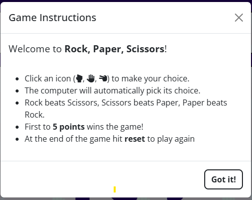
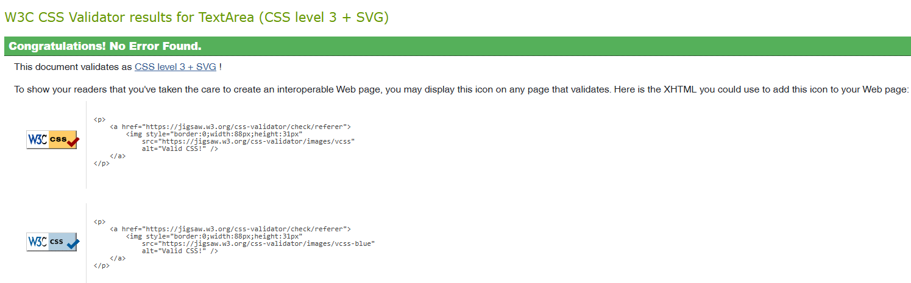
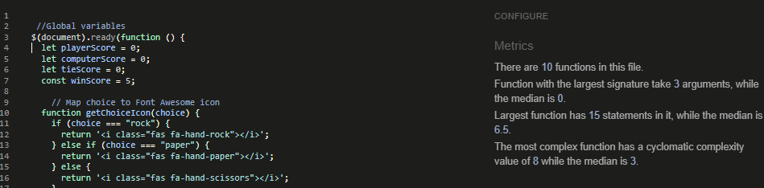

# Rock, Paper Scissors Project

### Live website can be found [here](https://darren-longhurst.github.io/rock-paper-scissors-mp2/index.html).
---
## Project Rationale

I chose to build a **Rock, Paper, Scissors** for my second milestone project becuase it is a well known, simple game and perfectly demonstrates entry level **JavaScript** logic and front end developement skills.
The mechanics of the game are straight forward, which allowed me time to focus on the UX, styling and game interactivity, rather than eplaining complex game rules.

The game contains **conditional logic, randomisation, event handling, global and block scope functions**.

## Index - Table of Contents ##

- [UX](#ux)
- [Design](#design)
- [Features](#features)
- [Technologies & Design](#technologies-and-design)
- [Testing](#testing)
- [Bugs](#bugs)
- [Depoloyment](#deployment)
- [Credits](#credits)
---
## UX

### User Stories

* T01 As a first time player, I want to quickly understand how to play the game and start playing without any confusion.
* T02 As a first time player, I want to clearly see my choice and the reflecting computer choice in order to understand how the game works.
* T03 As a first time player, I want to see the scoreboard update after either I or the computer has won a round so I can track progress in order to win the game.
* T04 As a first time player, I want the game to tell me when either I or the computer has won so I know the game is complete.
* T05 As a user, I want a reset button so I can restert the gme whenever I want
* T06 As a user, I want win/lose/draw visual feedback for the game to be stimulating and engaging.
* T07 As a user, I want clear instructions available in a seperate modal, so I can refer to these whenever I like and keep the game playing area free from clutter.
* T08 As a user, I want the interface to be mobile-friendly for me to play the game on whichever device I desire.
* T09 As a user, I want a 404 fallback error page with design continuity so if I land on the wrong link, I can see its part of the website and navigate back to the game easily.

## Design

### Colour Palette

### Background Image

* I used an image picker from the background image **(Rock, Paper, Scissors)** for the x2 container div's used in the game to pull the prominent colours for the buttons and text used throughout the site.
* I have also utilised CSS variables to allow quick global changes across the site if required.
* The upper, middle and lower div container box uses the background image with a white overlay set to 85% opacity.
* The body background uses #26006e, the Player icon uses  #f92aee , Computer icon uses  #0e79e8 , Choices icons also use  #26006e and the Result text is dynamic dependant on whether the result is win/tie/lose. i.e Player = #f92aee , Computer =  #0e79e8 Tie =  #26006e
* Gameplay scores also follow the same colour reflective principles.
* The **"Games Instructions"** button uses colour #26006e and then changes to #f92aee on:hover.
* The **Reset Game** button uses colour #f92aee and  #26006e on:hover.
* #ffff is used on button text with the hover attribute enabled to give greater contrast.

## Typography

* Google fonts have been used in this project and font family Open Sans & Cal Sans have been used with a sans-serif fallback font.
* CSS variables have been used throughout the CSS stylesheet to create globally accessible fonts, which keep continuity and are easily updated throughout the website.

## Wireframes

I have used Balsamiq **https://balsamiq.cloud/** to design the basic layout for this game. All pages and modals are dynamic and responsive, shown here in the wireframe image links:

* [Home Page](assets/README-files/wireframes/homepage_wireframe.png)
* [Instructions Modal](assets/README-files/wireframes/modal_wireframe.png)

## Features

### Header Container & Favicon

* The header is the first div container and holds both the **"Games Instructions"** and the **"Reset Game"** buttons. Also shown is the favicon which was created using **https://favicon.io/**
* The header is fully reponsive and access to both the **"Games Instructions"** and **"Reset Game"** buttons is available throughout the game.
* I have used Bootstrap custom css classes for button styling and targetted custom css for button:hover classes for added user claity whilst playing the game.

### Modal

* Clear and concise **"Games Instructions"** modal, available from the header container, once the relevant button is clicked.
* Modal contains Font-Awesome is used to show the player and computer icons in this window.
* Once finished reading, user selects the **"Got it!"** button in the bottom left of the modal.
* Modal button also uses bootstrap and custom targetted CSS. 

### Gamplay Area

* The Player and computer icons are clearly displayed and the initial icon display clearly refereces a player vs a computer icon.
* This game is a race to 5, the first to win 5 rounds, wins the game. 
* Round scores for the player, the computer and the number of ties is cleary detailed at the bottom of this window.
* Icons for the player to select are clearly shown in the middle of the page with the player selection and computers random selection, shown directly above.

### Result Area

* The result area container clearly shows the result of the round, once the round has taken place and contains dynammic information within it.
* On game startup It reads **"Let's go, show them who's boss!"**
* If you win a round it reads **"You win this round"** 
* If you lose a round it reads **"Computer wins this round"**
* If the round is a tie, it reads **"It's a tie"**
* If the computer wins the game **"Damn it, computer won the game!"**
* If the player wins the game **"Great job, you've won the game!"**
* Using Jquery, custom css and template literals, the text colour also dynamically updates in the result area to display either the player colour, computer colour or the draw colour dependant on which character has won the round/game.

### Future Code Implimentations

There were a couple of stretch goals that I would have loved to include but didn't have the time.
I would have loved to have offered the player the opportunity to choose other Rock, Paper, Scissors game variants. As well as the first to 5 option, these would have included:

* A timed mode, to see how many wins could be acheived in a set time frame.
* A race to see how many player rounds could be won before the computer reaches a set number of rounds (e.g. 7).
* Custom player icons (e.g. Water, Fire, Sand) working in the same way as Rock paper Scissors with different permutations. 

## Technologies and Design

* HTML5 and CSS 3 programming languages for semantic layout and styling
* JavaScript (ES6) For running the game logic and scoreboard updates
* JQuery To simplify DOM manipulation and event handling
* Font Awesome iProviding the games icons
* [Bootstrap](https://getbootstrap.com/) 5.3.3 For responsive layout and custom attributes
* CSS Variables For defining reusable colours and consistent syling
* Visual Studio Code - As my IDE using command line to push code to GitHub
* Github - To host my repository

## Testing
### (Manual & Integration)

I wanted to demonstrate how to utilise both manual and integration tests throughout this project.
Both have their pro's and cons but I feel both are essential in order to produce a well rounded and complete project.

### Manual testing pros and cons:

**Pros:**

* Easy to start, no setup needed.

* Good for finding usability issues.

**Cons:**

* Time-consuming.

* Prone to human error.

* Not scalable for large projects.

### Integration testing pros and cons

**Pros:**

* Faster, repeatable, and reliable.

* Great for catching bugs early when components don’t “talk” to each other correctly.

**Cons:**

* Requires setup (e.g., Jest or Mocha).

* More technical knowledge needed

### Manual Testing

* [W3C HTML](https://validator.w3.org/) HTML markup validator 
* [W3C CSS](https://jigsaw.w3.org/css-validator/) validator 
* Testing responsiveness, performance and accessibilty with Google Dev tools and lighthouse

### Responsiveness and browser compatibility

* Website tested across multiple browsers (Chrome/Safari/IE/Firefox) and using all available options of device screensize through Chrome dev tools for responsiveness. Dev tools has been great for ironing out padding issues linked to various screen sizes which I'll elaborate on in the #bugs section.

## Github pages deployment

* Initial Pages deployment flagged a directory issue with the background image. 

This was corrected from: **(assets/images/rock-paper-scissors-hand-icons.png)** to 
                         **(../images/rock-paper-scissors-hand-icons.png)**

## Validator testing

### HTML

* [W3C HTML](https://validator.w3.org/) used to check validation of each page of the project and check for any code sytax errors throughout.
* One error code found being a forward / before the closing bracket around the favicon section in the header within index.html where no closing / was needed, using the find and search function within vs code, all unwanted items were removed and retested receiving a pass.

## CSS

[W3C CSS](https://jigsaw.w3.org/css-validator/) validator was used to check css validity, no errors were reported.

## JS Hint

Js Hint validator didn't flag any issues through it's emulator

### Lighthouse

With validity testing complete, I opened chome dev tools and lighthouse to check the sites performance and accessibility.

No issues of note, website performance is very good. 

## Manual test cases

Test cases in the table reflect user stories mentioned earlier in this docuement:

## Jest Integration testing

All 9 Jest test cases passed through Jest with no issues

Here is a copy of the Jest test cases

## bugs

* There were a few incidents of needing to use increased attribute specificity in order to apply custom CSS styling becasue of Bootstrap conflicts. One example being my use of custom button CSS styling, I had to add an additional level css specificity to target the HTML succesfully.

## Deployment

The project was deployed to GitHub Pages using the following steps...

1. Log in to GitHub and locate the [GitHub Repository](https://github.com/)
2. At the top of the Repository (not top of page), locate the "Settings" Button on the menu.
 - Alternatively Click [Here](https://github.com/) for a GIF demonstrating the process starting from Step 2.
3. Scroll down the Settings page until you locate the "GitHub Pages" Section.
4. Under "Source", click the dropdown called "None" and select "Master Branch".
5. The page will automatically refresh.
6. Scroll back down through the page to locate the now published site link in the "GitHub Pages" section.
## Forking
By forking the GitHub Repository we make a copy of the original repository on our GitHub account to view and/or make changes without affecting the original repository by using the following steps...
Scroll back down through the page to locate the now published site link in the "GitHub Pages" section.
1. Log in to GitHub and locate the [GitHub Repository](https://github.com/)
2. At the top of the Repository (not top of page) just above the "Settings" Button on the menu, locate the "Fork" Button.
3. You should now have a copy of the original repository in your GitHub account.
## Making a Local Clone
1. Log in to GitHub and locate the [GitHub Repository](https://github.com/)
2. Under the repository name, click "Clone or download".
3. To clone the repository using HTTPS, under "Clone with HTTPS", copy the link.
4. Open Git Bash
5. Change the current working directory to the location where you want the cloned directory to be made.
6. Type `git clone`, and then paste the URL you copied in Step 3.

    <pre><code>`$ git clone https://github.com/YOUR-USERNAME/YOUR-REPOSITORY`</code></pre>

7. Press Enter. Your local clone will be created.

    <pre><code>$ git clone https://github.com/YOUR-USERNAME/YOUR-REPOSITORY`
    Cloning into `CI-Clone`...
    remote: Counting objects: 10, done.
    remote: Compressing objects: 100% (8/8), done.
    remove: Total 10 (delta 1), reused 10 (delta 1)
    Unpacking objects: 100% (10/10), done.</code></pre>

## Credits 

* For game inspiration I visited https://www.codewizardshq.com/javascript-tutorial-for-kids-rock-paper-scissors/
* When stuck in a bit of a code block, I found [W3 Schools](https://www.w3schools.com/) particularly helpful.
* For formatting HTML and CSS I used [Beautifier.io](https://beautifier.io/)
* Thanks to my tutor Brian Macharia for all is help with this.

